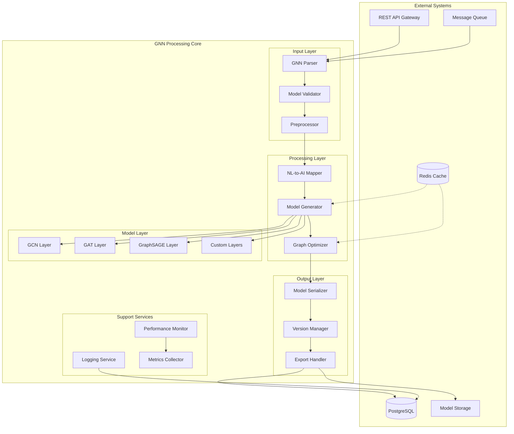
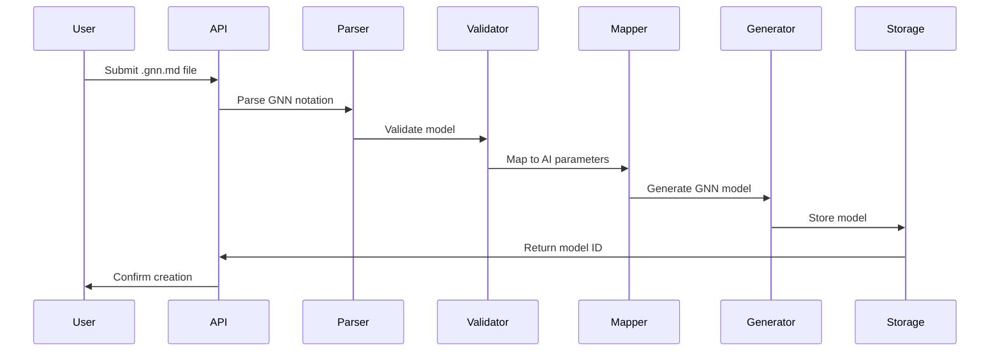
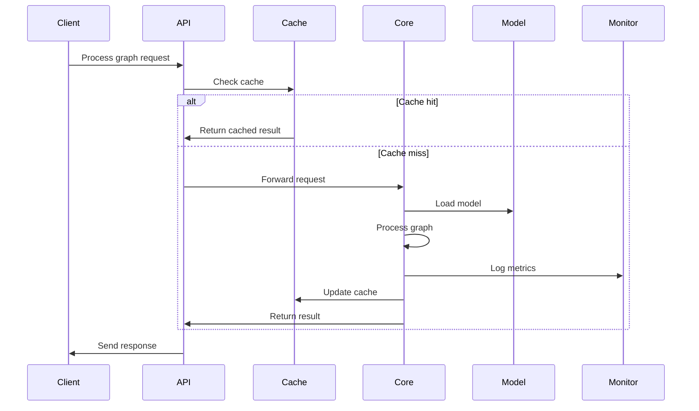

# GNN Processing Core Architecture

## Table of Contents
1. [Overview](#overview)
2. [System Architecture](#system-architecture)
3. [Component Descriptions](#component-descriptions)
4. [Data Flow](#data-flow)
5. [Interfaces](#interfaces)
6. [Performance Requirements](#performance-requirements)
7. [Scalability Considerations](#scalability-considerations)
8. [Integration Points](#integration-points)
9. [Security Considerations](#security-considerations)
10. [Deployment Architecture](#deployment-architecture)

## Overview

The GNN (Generalized Notation Notation) Processing Core is a critical component of the FreeAgentics platform that enables natural language to Active Inference parameter mapping. It processes .gnn.md files, validates models, and generates appropriate Graph Neural Network architectures for agent behavior modeling.

### Key Objectives
- Parse and validate GNN model definitions from .gnn.md files
- Map natural language descriptions to Active Inference parameters
- Generate GNN architectures based on agent personalities
- Provide versioning and evolution tracking for models
- Ensure high performance and scalability

### Design Principles
- **Modularity**: Components are loosely coupled and independently deployable
- **Extensibility**: Easy to add new GNN layer types and parsing formats
- **Performance**: Optimized for both batch and real-time processing
- **Reliability**: Comprehensive validation and error handling
- **Observability**: Detailed logging and monitoring capabilities

## System Architecture



## Component Descriptions

### Input Layer

#### GNN Parser
- **Purpose**: Parse .gnn.md files and extract model definitions
- **Responsibilities**:
  - Lexical analysis of GNN notation
  - Syntax tree generation
  - Format validation
  - Error reporting with line numbers
- **Technologies**: Python with ANTLR4 or custom recursive descent parser
- **Interfaces**: File input, JSON/AST output

#### Model Validator
- **Purpose**: Ensure model definitions are semantically correct
- **Responsibilities**:
  - Schema validation
  - Constraint checking
  - Dependency resolution
  - Compatibility verification
- **Technologies**: JSON Schema, custom validation rules
- **Interfaces**: AST input, validation result output

#### Preprocessor
- **Purpose**: Prepare data for processing
- **Responsibilities**:
  - Feature normalization
  - Missing data handling
  - Data type conversion
  - Graph structure optimization
- **Technologies**: NumPy, NetworkX
- **Interfaces**: Raw data input, normalized data output

### Processing Layer

#### NL-to-AI Mapper
- **Purpose**: Map natural language descriptions to Active Inference parameters
- **Responsibilities**:
  - Natural language processing
  - Parameter extraction
  - Semantic mapping
  - Ambiguity resolution
- **Technologies**: spaCy, Transformers, custom NLP models
- **Interfaces**: Text input, parameter dictionary output

#### Model Generator
- **Purpose**: Generate GNN architectures from specifications
- **Responsibilities**:
  - Architecture selection
  - Layer configuration
  - Hyperparameter setting
  - Model instantiation
- **Technologies**: PyTorch Geometric, DGL
- **Interfaces**: Specification input, model object output

#### Graph Optimizer
- **Purpose**: Optimize graph structures for efficient processing
- **Responsibilities**:
  - Graph partitioning
  - Subgraph extraction
  - Memory optimization
  - Batch formation
- **Technologies**: METIS, custom algorithms
- **Interfaces**: Graph input, optimized graph output

### Model Layer

#### GNN Layer Implementations
- **GCN (Graph Convolutional Network)**:
  - Spectral-based convolution
  - Efficient for undirected graphs
  - Configurable aggregation functions

- **GAT (Graph Attention Network)**:
  - Attention-based aggregation
  - Dynamic edge weighting
  - Multi-head attention support

- **GraphSAGE**:
  - Sampling-based approach
  - Inductive learning capability
  - Various aggregator options

- **Custom Layers**:
  - Plugin architecture for new layer types
  - Template-based implementation
  - Performance profiling hooks

### Output Layer

#### Model Serializer
- **Purpose**: Convert models to storable formats
- **Responsibilities**:
  - Binary serialization
  - JSON representation
  - Compression
  - Checkpointing
- **Technologies**: Protocol Buffers, MessagePack
- **Interfaces**: Model input, serialized output

#### Version Manager
- **Purpose**: Track model evolution and versions
- **Responsibilities**:
  - Version numbering
  - Diff generation
  - Rollback support
  - Migration paths
- **Technologies**: Git-based versioning, custom metadata
- **Interfaces**: Model input, versioned model output

#### Export Handler
- **Purpose**: Export models in various formats
- **Responsibilities**:
  - Format conversion
  - Platform-specific optimization
  - Deployment packaging
  - Documentation generation
- **Technologies**: ONNX, TorchScript
- **Interfaces**: Model input, exported package output

### Support Services

#### Performance Monitor
- **Purpose**: Track system performance metrics
- **Responsibilities**:
  - Latency measurement
  - Throughput monitoring
  - Resource utilization
  - Bottleneck identification
- **Technologies**: Prometheus, Grafana
- **Interfaces**: Metric collection API

#### Logging Service
- **Purpose**: Comprehensive system logging
- **Responsibilities**:
  - Structured logging
  - Log aggregation
  - Search and analysis
  - Audit trails
- **Technologies**: Python logging, ELK stack
- **Interfaces**: Log ingestion API

#### Metrics Collector
- **Purpose**: Collect and aggregate system metrics
- **Responsibilities**:
  - Custom metric definition
  - Time-series storage
  - Alert generation
  - Dashboard support
- **Technologies**: StatsD, InfluxDB
- **Interfaces**: Metric submission API

## Data Flow

### Model Creation Flow


### Model Processing Flow


## Interfaces

### REST API Endpoints

#### Model Management
```yaml
POST /api/v1/models
  Description: Create new GNN model from .gnn.md file
  Request:
    - file: .gnn.md content
    - metadata: model metadata
  Response:
    - model_id: unique identifier
    - version: model version
    - status: creation status

GET /api/v1/models/{model_id}
  Description: Retrieve model details
  Response:
    - model: serialized model
    - metadata: model information
    - versions: available versions

PUT /api/v1/models/{model_id}
  Description: Update existing model
  Request:
    - updates: model modifications
  Response:
    - version: new version number
    - diff: changes from previous

DELETE /api/v1/models/{model_id}
  Description: Delete model (soft delete)
  Response:
    - status: deletion status
```

#### Processing Endpoints
```yaml
POST /api/v1/process
  Description: Process graph with specified model
  Request:
    - model_id: model to use
    - graph: input graph data
    - options: processing options
  Response:
    - results: processing output
    - metrics: performance data

POST /api/v1/batch
  Description: Batch process multiple graphs
  Request:
    - model_id: model to use
    - graphs: array of graphs
    - options: batch options
  Response:
    - job_id: batch job identifier
    - status: processing status

GET /api/v1/jobs/{job_id}
  Description: Check batch job status
  Response:
    - status: current status
    - progress: completion percentage
    - results: partial/complete results
```

### Internal APIs

#### Parser Interface
```python
class GNNParser:
    def parse(self, content: str) -> ParseResult:
        """Parse GNN notation from string content"""

    def parse_file(self, filepath: Path) -> ParseResult:
        """Parse GNN notation from file"""

    def validate_syntax(self, content: str) -> List[SyntaxError]:
        """Validate syntax without full parsing"""
```

#### Model Generator Interface
```python
class ModelGenerator:
    def generate(self, spec: ModelSpec) -> GNNModel:
        """Generate GNN model from specification"""

    def configure_layers(self, layers: List[LayerSpec]) -> nn.Module:
        """Configure model layers"""

    def optimize_architecture(self, model: GNNModel) -> GNNModel:
        """Optimize model architecture"""
```

## Performance Requirements

### Latency Requirements
- **Model Creation**: < 5 seconds for typical models
- **Single Graph Processing**: < 100ms for graphs up to 1000 nodes
- **Batch Processing**: < 10ms per graph in batch mode
- **Model Loading**: < 500ms from cache, < 2s from storage

### Throughput Requirements
- **Concurrent Requests**: Support 100+ concurrent model operations
- **Batch Size**: Process batches up to 10,000 graphs
- **Model Storage**: Handle 10,000+ model versions
- **Cache Hit Rate**: Maintain > 90% cache hit rate

### Resource Requirements
- **Memory**:
  - Base: 2GB for core services
  - Per Model: 100MB-1GB depending on complexity
  - Cache: 8GB recommended
- **CPU**:
  - Minimum: 4 cores
  - Recommended: 8-16 cores for production
- **GPU**:
  - Optional for CPU-only mode
  - Recommended: NVIDIA GPU with 8GB+ VRAM
- **Storage**:
  - Models: 100GB for model repository
  - Logs: 50GB rolling window
  - Cache: 20GB for Redis

## Scalability Considerations

### Horizontal Scaling
- **Stateless Services**: Parser, Validator, and Processor are stateless
- **Load Balancing**: Round-robin or least-connections
- **Shared Storage**: Models stored in distributed storage (S3, GCS)
- **Cache Clustering**: Redis cluster for distributed caching

### Vertical Scaling
- **GPU Acceleration**: Scale up with more powerful GPUs
- **Memory Scaling**: Increase cache size for larger models
- **CPU Scaling**: More cores for parallel processing

### Auto-scaling Policies
```yaml
CPU-based:
  - Scale up: CPU > 80% for 5 minutes
  - Scale down: CPU < 20% for 10 minutes

Memory-based:
  - Scale up: Memory > 85%
  - Scale down: Memory < 30%

Queue-based:
  - Scale up: Queue depth > 100
  - Scale down: Queue depth < 10
```

## Integration Points

### External Services
- **PostgreSQL**: Model metadata, audit logs
- **Redis**: Caching layer, job queue
- **S3/GCS**: Model artifact storage
- **Prometheus**: Metrics collection
- **Grafana**: Monitoring dashboards

### Internal Services
- **Agent Engine**: Consumes generated models
- **API Gateway**: Request routing and authentication
- **Message Queue**: Async processing requests
- **Knowledge Graph**: Model relationship tracking

### Client Libraries
```python
# Python client example
from freeagentics import GNNClient

client = GNNClient(api_key="...")
model = client.create_model(file_path="model.gnn.md")
result = client.process_graph(model_id=model.id, graph=graph_data)
```

## Security Considerations

### Authentication & Authorization
- **API Keys**: Service-to-service authentication
- **JWT Tokens**: User authentication
- **RBAC**: Role-based access control for models
- **OAuth2**: Third-party integrations

### Data Security
- **Encryption at Rest**: Model storage encryption
- **Encryption in Transit**: TLS 1.3 for all communications
- **Input Validation**: Strict validation of all inputs
- **Sandboxing**: Model execution in isolated environments

### Compliance
- **Audit Logging**: All model operations logged
- **Data Retention**: Configurable retention policies
- **GDPR**: Support for data deletion requests
- **Model Provenance**: Track model lineage

## Deployment Architecture

### Container Architecture
```yaml
services:
  gnn-parser:
    image: freeagentics/gnn-parser:latest
    replicas: 3
    resources:
      cpu: 2
      memory: 4Gi

  gnn-processor:
    image: freeagentics/gnn-processor:latest
    replicas: 5
    resources:
      cpu: 4
      memory: 8Gi
      gpu: 1

  gnn-api:
    image: freeagentics/gnn-api:latest
    replicas: 3
    resources:
      cpu: 2
      memory: 2Gi
```

### Kubernetes Deployment
```yaml
apiVersion: apps/v1
kind: Deployment
metadata:
  name: gnn-processing-core
spec:
  replicas: 3
  selector:
    matchLabels:
      app: gnn-core
  template:
    metadata:
      labels:
        app: gnn-core
    spec:
      containers:
      - name: gnn-processor
        image: freeagentics/gnn-processor:latest
        resources:
          requests:
            memory: "4Gi"
            cpu: "2"
          limits:
            memory: "8Gi"
            cpu: "4"
            nvidia.com/gpu: "1"
```

### Health Checks
```yaml
livenessProbe:
  httpGet:
    path: /health/live
    port: 8080
  initialDelaySeconds: 30
  periodSeconds: 10

readinessProbe:
  httpGet:
    path: /health/ready
    port: 8080
  initialDelaySeconds: 5
  periodSeconds: 5
```

## Monitoring & Observability

### Key Metrics
- **System Metrics**:
  - Request rate and latency
  - Error rate and types
  - CPU/Memory/GPU utilization
  - Cache hit/miss rates

- **Business Metrics**:
  - Models created per hour
  - Processing throughput
  - Model complexity distribution
  - User engagement metrics

### Dashboards
- **Operations Dashboard**: System health, performance metrics
- **Business Dashboard**: Usage patterns, model statistics
- **Alert Dashboard**: Active alerts, incident tracking

### Alerting Rules
```yaml
- alert: HighErrorRate
  expr: error_rate > 0.05
  for: 5m
  annotations:
    summary: "High error rate detected"

- alert: LowCacheHitRate
  expr: cache_hit_rate < 0.8
  for: 10m
  annotations:
    summary: "Cache hit rate below threshold"

- alert: ModelProcessingLatency
  expr: p99_latency > 1000
  for: 5m
  annotations:
    summary: "High processing latency detected"
```

## Future Considerations

### Planned Enhancements
1. **Federated Learning**: Support for distributed model training
2. **Model Marketplace**: Share and discover GNN models
3. **AutoML Integration**: Automatic model architecture search
4. **Real-time Streaming**: Support for streaming graph data
5. **Multi-language Support**: Clients for Java, Go, Rust

### Research Directions
1. **Novel GNN Architectures**: Implement cutting-edge GNN variants
2. **Explainability**: Model interpretation and visualization
3. **Adversarial Robustness**: Defense against graph attacks
4. **Quantum GNN**: Exploration of quantum computing integration

---

This architecture document serves as the blueprint for implementing the GNN Processing Core. It should be reviewed and updated as the system evolves and new requirements emerge.
